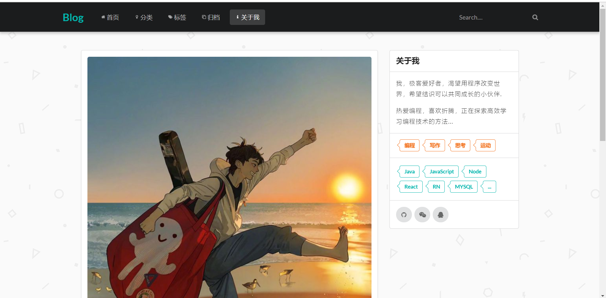
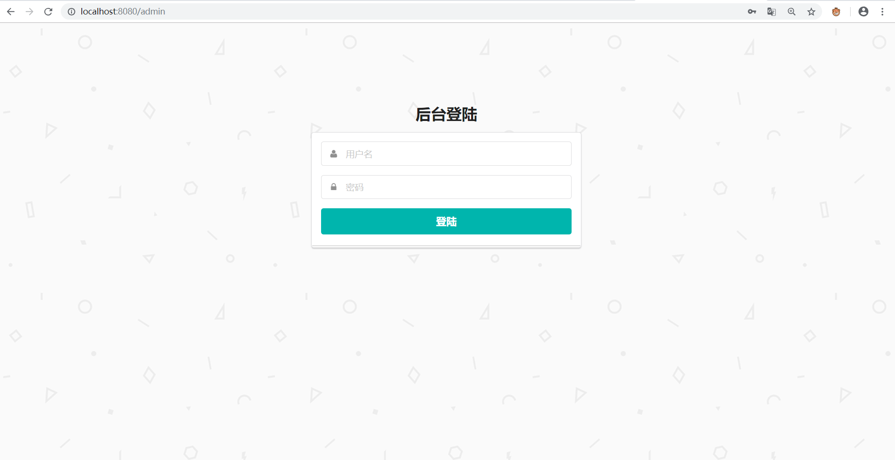

# 关于项目

该博客是基于springboot实现的一个个人博客系统。
主要涉及技术包括的包括 springboot、JPA、Thymeleaf等。
前端采用Semantic UI框架,有很多例子方便使用，具体参考以下网址 
官网地址：[https://semantic-ui.com/](https://semantic-ui.com/)   
后端使用druid数据源，方便管理控制

## 效果预览
前台效果图   

 
后台效果图   

 
后台地址：/admin  

## 使用注意
#### 1.开发工具的选择
请使用 IntelliJ IDEA,

#### 2.项目使用数据库为mysql，请确保数据库版本是5.x 版本，8.x版本需要修改配置
对于MySQL8.x版本需要修改 pom.xml 里MySQL驱动版本和数据库驱动名称,具体为com.mysql.cj.jdbc.Driver

#### 3.项目相对较小，使用JPA操作数据库节省部分sql编写，运行项目即可在对应数据库中生成数据表

具体情况请看步骤

## 使用注意事项

#### 1、数据库配置   
数据库配置需要根据本地设置自行修改，项目使用druid数据源监听，后台地址为/druid,可根据需求重置账户和密码
由于使用JPA,需要预先在本地创建名为blog数据库（名字可在yml中更改），项目第一次运行即自动创建数据表，无需再写sql生成

#### 2、后台管理
后台登陆需手动在地址栏输入，登陆地址为/admin，账户密码等须在数据库表生成后手动添加，此处后续还待完善。。。

## 下载地址：
Github地址：https://github.com/PlutoYK/blog
（如果可以帮忙点一次Star和Fork）
 
## 更新记录
首次提交：2020年3月24日   

