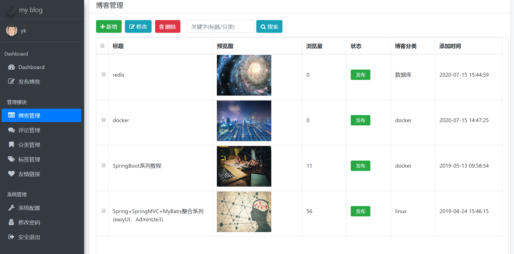
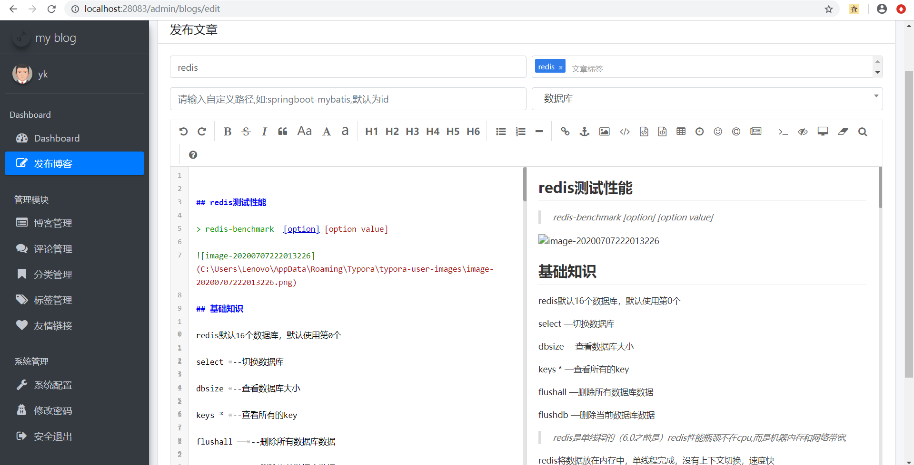
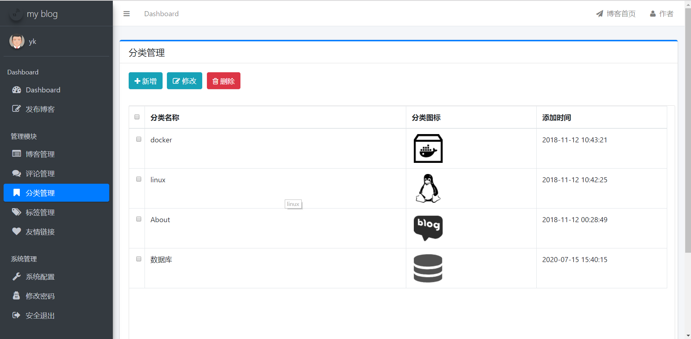
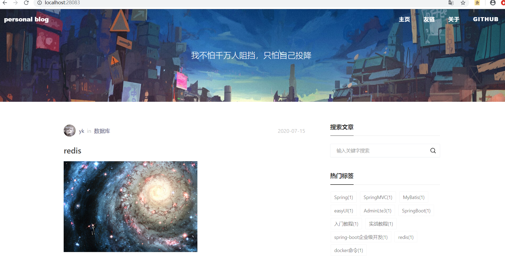
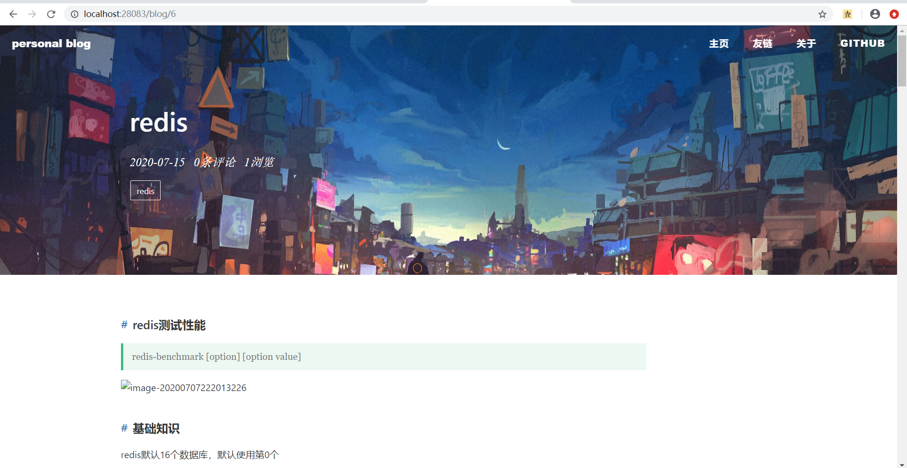

# Blog
# 关于项目
该博客是基于springboot实现的一个个人博客系统。主要涉及技术包括的包括springboot，MyBatis，Thymeleaf等

**坚持不易，各位朋友如果觉得项目还不错的话可以给项目一个 star 吧，谢谢各位的支持。**


## 注意事项
- **项目使用数据库为mysql，请确保数据库版本为5.x版本，8.x版本需要修改配置,对于MySQL8.x版本需要修改pom.xml里MySQL驱动版本和数据库驱动名称，具体为com.mysql.cj.jdbc.Driver**
- **数据库文件目录为```static-files/my_blog_db.sql```；**
- **部署后你可以根据自己需求修改版权文案、logo 图片、备案记录等网站基础信息；**
- **Blog 后台管理系统的默认登陆账号为 admin 默认登陆密码为 123456；**
- **Blog 还有一些不完善的地方，本人目前还在不断学习，项目后续还在更新中；**
- **欢迎反馈问题一起交流**


## 联系作者

- 我的邮箱：jxjjyekang@163.com

## 效果预览

### 后台管理页面

- 登录页

	

- 后台首页

    

- 文章编辑

	
	
- 标签管理

    


### 博客展示页面

- 首页

	

- 文章浏览

	


## 更新记录
  首次提交：2020年3月24日   
  项目重构：2020年7月15日
## 参考感谢

- [eladmin](https://github.com/elunez/eladmin)
- [My-Blog](https://github.com/ZHENFENG13/My-Blog)

